## Project 6: Final Project Gear Up

The project handout can be found [here](https://cs1230.graphics/projects/final/gear-up).

### Test Cases

Insert your test cases here. Be sure to include images/videos as needed!

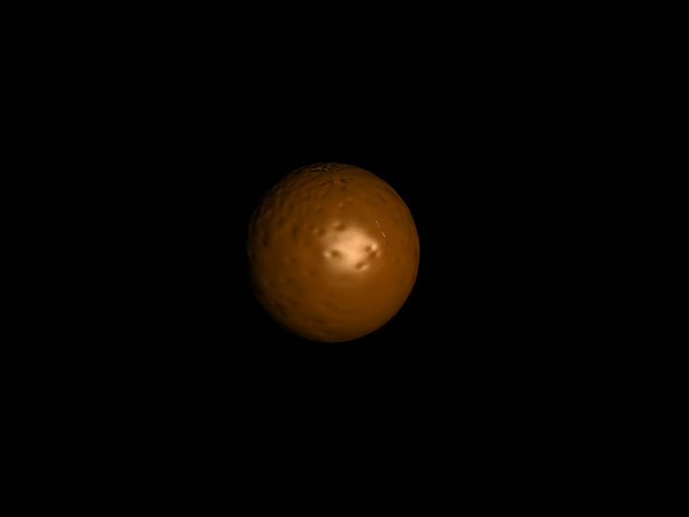
[orange_bump-slider.mov](student_outputs/bump-mapping/orange_bump-slider.mov)

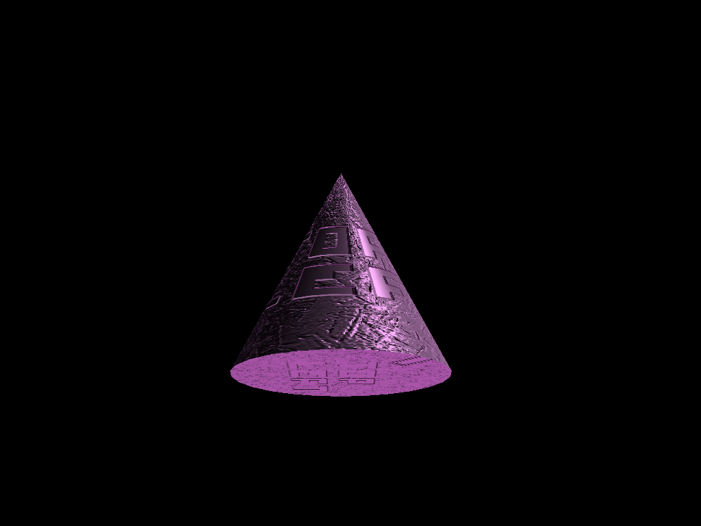
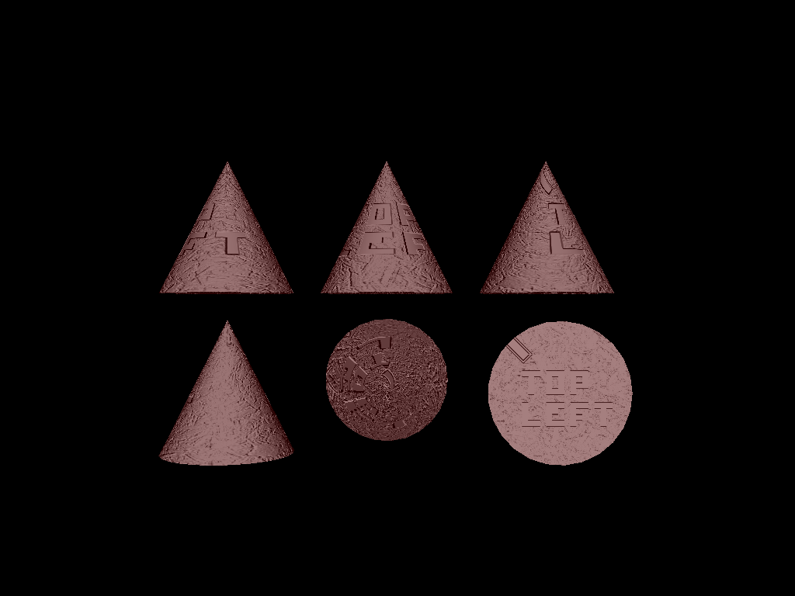

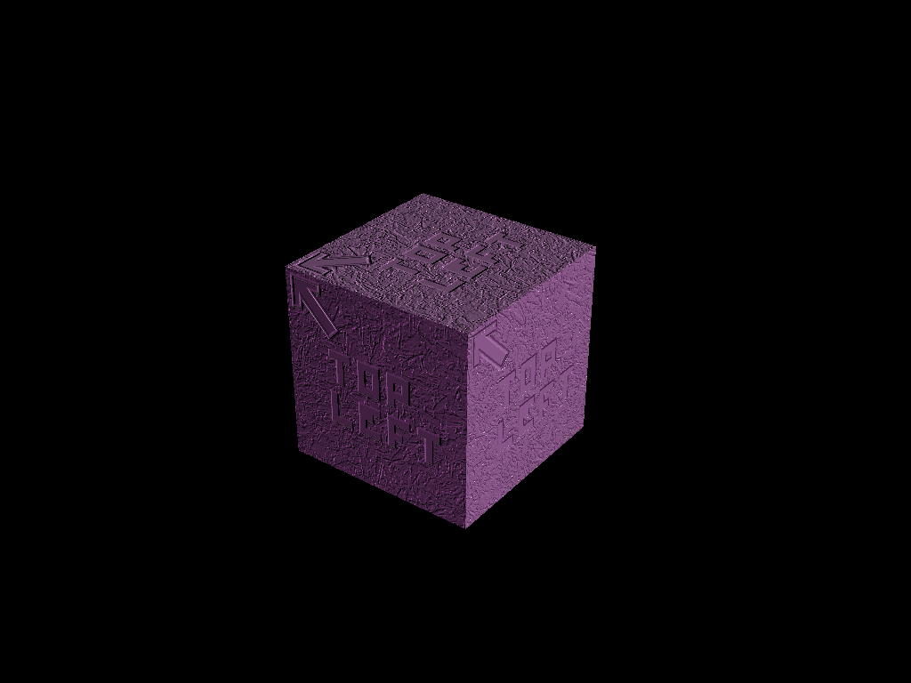
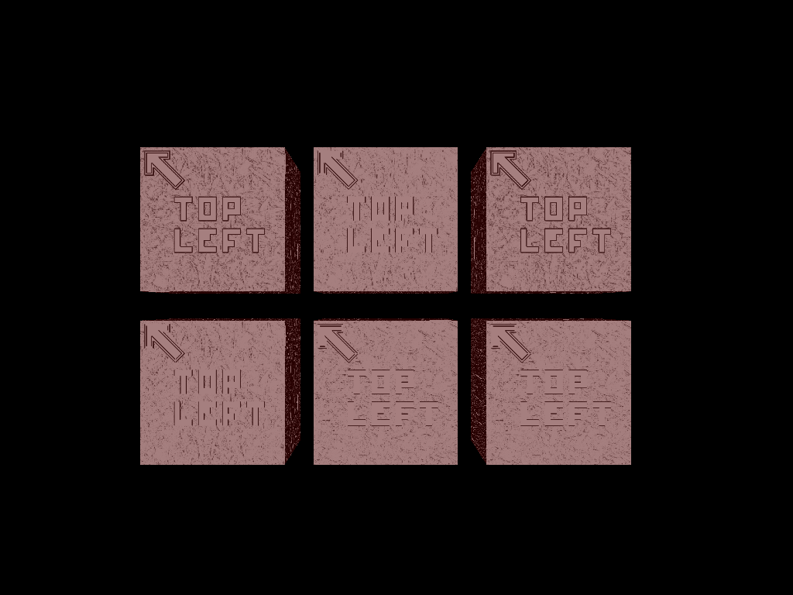

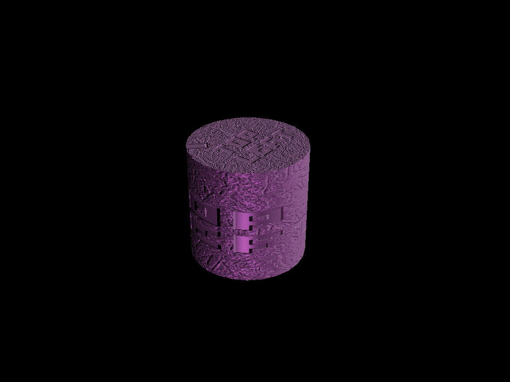
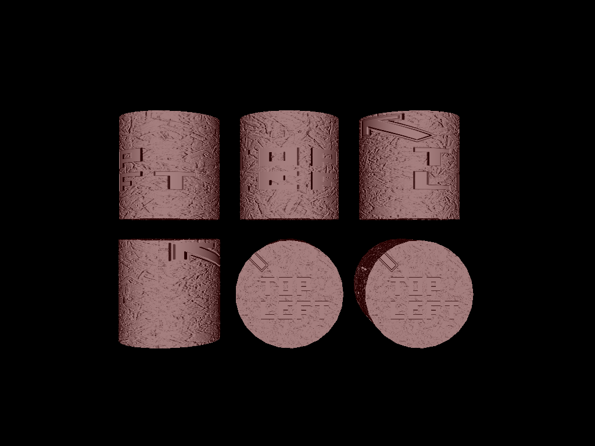

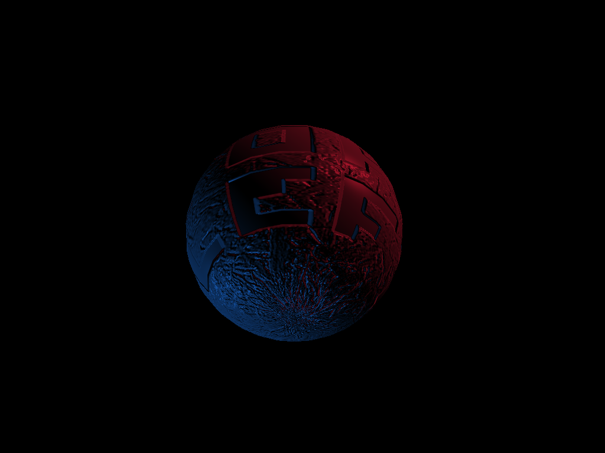
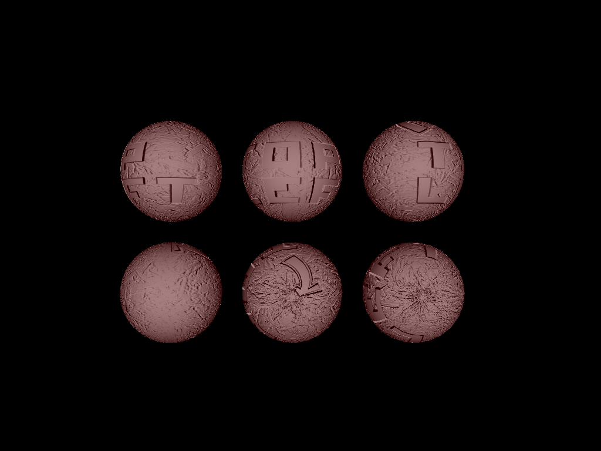

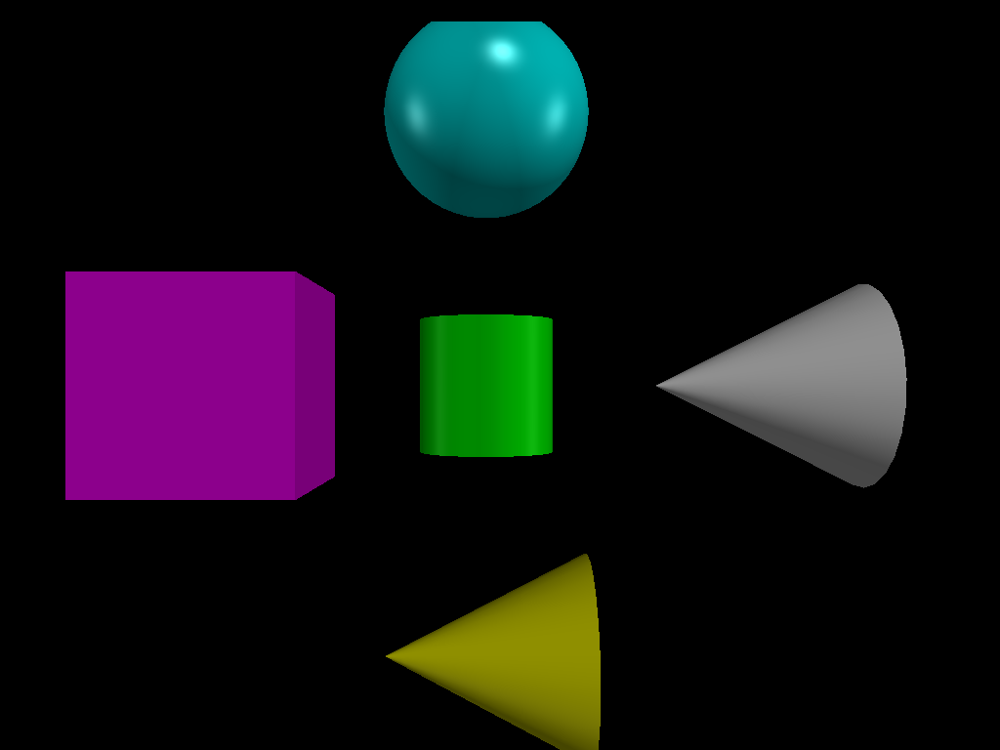
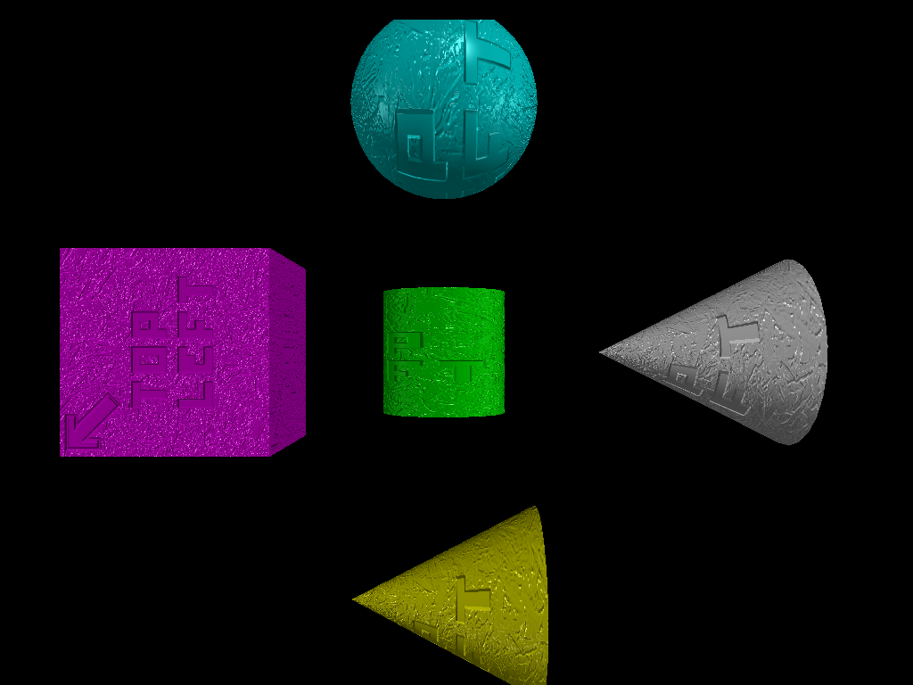
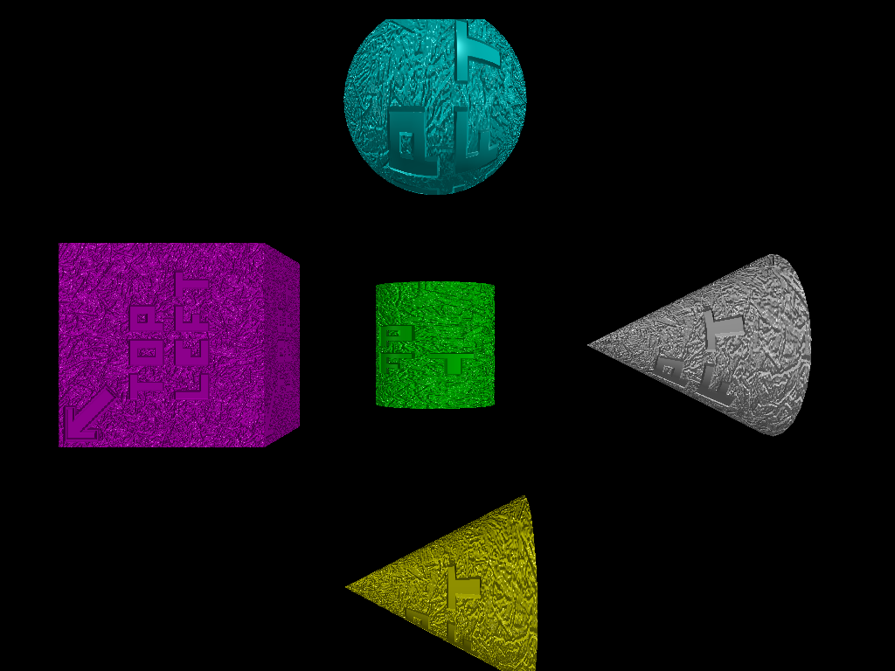

[phong-total_bump-slider.mov](student_outputs/bump-mapping/phong-total_bump-slider.mov)

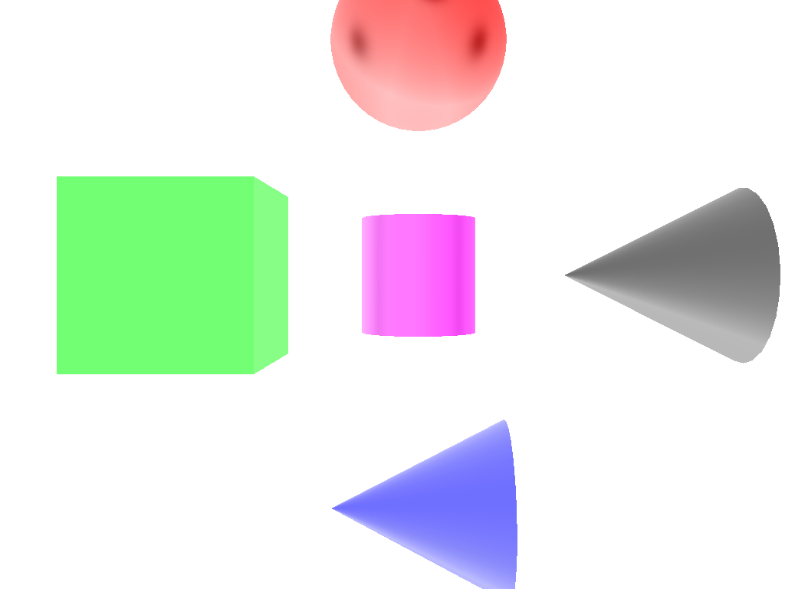
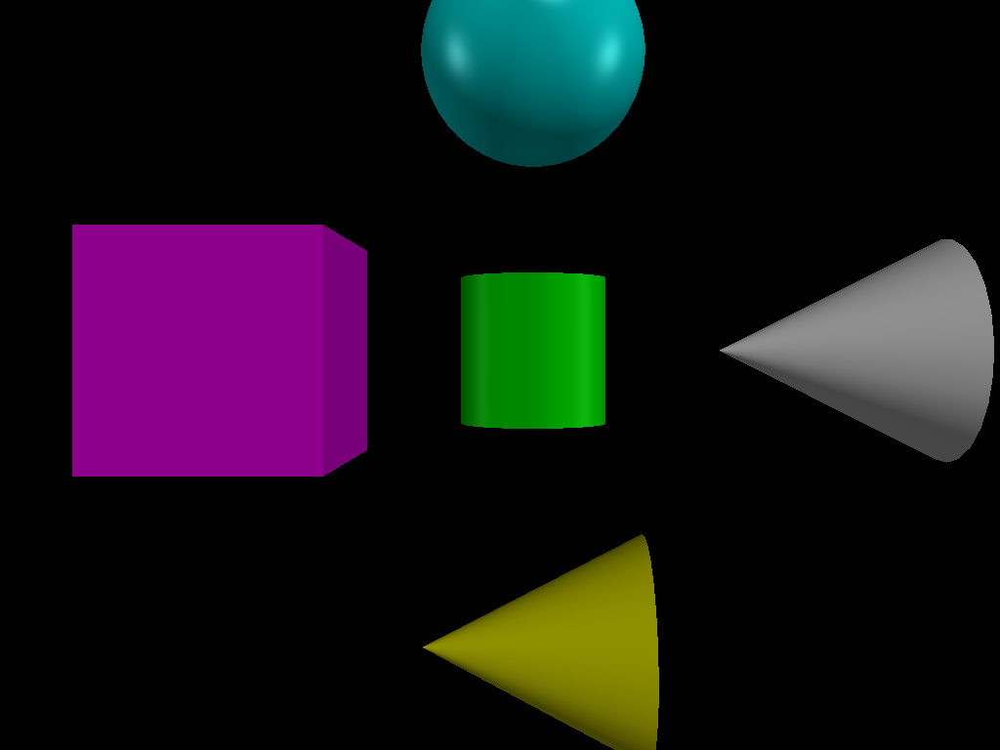

### Design Choices

Implemented bumpmapping and setup the post-processing pipeline with the invert filter. (will be implementing color grading for final)

I wanted the bumps to be interactive, added a tolerance slider that switches between outward bumps and inward bumps

both bump-mapping and the inversion filter are controlled by a boolean variable in settings, which detects whether or not that effect is being used.

### Collaboration/References
n/a

### Known Bugs
n/a

### Extra Credit
n/a
